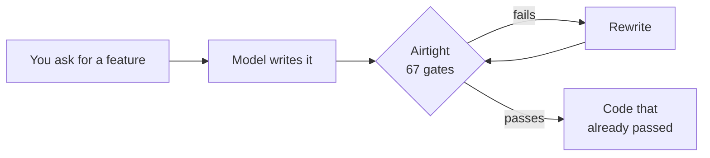

<p align="center">
  <picture>
    <source media="(prefers-color-scheme: dark)" srcset="assets/airtight-logo-dark.png">
    
  </picture>
</p>

<p align="center">
  <a href="LICENSE"></a>
  
  
  
  <a href="https://github.com/Zyoffsec/airtight-secure-coding/stargazers"></a>
  <a href="https://www.linkedin.com/in/ashot-mxitaryan/"></a>
</p>

**AI writes your code. Who checks it?**

Ask for a login and you get a good one — argon2, `httpOnly` cookies, ownership inside the query. The model knows all that. What it skips is the part nobody asked for: the rate limit, the lockout, the audit log. Guess the password thirty times and nothing stops you — no throttle, no record, invisible.

**Airtight is the part of the request nobody makes:** hard gates on what the assistant may emit, checked *before* the code reaches you.



## Measured, not claimed

Same brief, two agents — one with Airtight, one without. A blind third scored and ran both.

> **24 applicable gates &rarr; 24/24 with Airtight, 21/24 without.**

The three misses: no rate limit, no lockout, no security log. Verified live — thirty guesses returned thirty `401`s with zero throttle and zero records; the Airtight build returned `429` and wrote ten audit lines. The control was *good* (scrypt, `timingSafeEqual`, `httpOnly`, ownership) — the gaps were **omissions, not bad crypto.**

Both apps and the full comparison &rarr; [`validation/`](validation/).

## Install

```bash
npx skills add Zyoffsec/airtight-secure-coding
```

Or clone it into your skills folder (Claude Code, Cursor, Codex):

```bash
git clone https://github.com/Zyoffsec/airtight-secure-coding ~/.claude/skills/airtight
```

**Then forget it.** Airtight runs itself — write code as usual and the gates apply silently. No command to invoke.

## Usage

| Command | What it does |
| --- | --- |
| *(default)* | You write code; gates apply silently. |
| `airtight audit <target>` | Scores code against the gates. Read-only. |
| `airtight harden <target>` | Finds and fixes gate failures. |
| `airtight prove <target>` | Probes your local code with edge-case input. |

## What it catches

**67 gates across 13 topics**, mapped to **OWASP Top 10 (2021) + CWE**. Each is binary and numbered — every finding cites its gate. Full list &rarr; [`references/gates.md`](references/gates.md).

What it **doesn't**: business-logic bugs, unknown CVEs in your dependencies, or architecture review — those need a human. Airtight is the *first* check, on the mistakes mechanical enough to check mechanically. It never calls code "secure" — only which gates held.

## Demo

*A 30-second recording is coming — a good login, thirty silent break-in attempts, then the same with Airtight &rarr; `429` and a full audit log. It is the point of the whole project. [Contributions welcome.](CONTRIBUTING.md)*

---

MIT License &middot; [Contributing](CONTRIBUTING.md)
