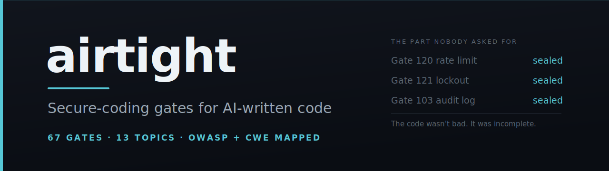

<p align="center">
  
</p>

**AI writes your code. Who checks it?**

You asked for a login form. You got a good one. The password is hashed with a memory-hard KDF and a
per-user salt. The session cookie is `httpOnly`. The notes query puts ownership inside the lookup and
returns 404 rather than 403. The search endpoint binds its parameter and escapes the `LIKE`
wildcards — a step most humans skip. Nobody asked for any of that. The model knew.

Then I guessed the password thirty times in ten seconds. Thirty 401s, no delay, no lockout, no 429.
Not one line written to a log. The attack was invisible while it ran and unreconstructable after.

That is the shape of the problem, and it is not the one everybody talks about. The model is good at
what it thinks about. It does not think about what nobody asked for — the limit, the lockout, the
audit line, the ceiling. You asked for a login form. You did not ask for one that survives contact
with an attacker, so you did not get one.

The code was not bad. It was incomplete. Airtight is the part of the request nobody makes: a set of
hard conditions on what the assistant may emit, checked before the code reaches you.

<!-- DEMO: terminal recording goes here. Three beats, taken from the measured A/B below —
     do not stage anything that did not happen:
       (1) A model writes the login endpoint from a plain feature brief. Show that the code is
           GOOD: argon2/scrypt, httpOnly, ownership in the WHERE clause. This beat must land, or
           the point is lost — the villain is not a bad model.
       (2) Thirty wrong passwords in ten seconds. Thirty 401s. Zero throttling. Zero log lines.
       (3) Same brief, Airtight loaded. Same thirty guesses -> 429, and the auth log fills up.
     Closing card: "The code was not bad. It was incomplete."
     Record with asciinema, embed as GIF. -->

> **The demo above does not exist yet.** It is the single most important asset in this repository —
> the three beats are what the project is, and a reader who watches them needs no further
> explanation. Until it is recorded, everything below is telling rather than showing. Contributions
> welcome; see [CONTRIBUTING.md](CONTRIBUTING.md).

## Install

**Skills CLI** — the one-liner, for Claude Code, Cursor, or Codex:

```
npx skills add Zyoffsec/airtight-secure-coding
```

**Manual** — clone it into your Claude Code **skills folder**: the place Claude Code keeps your skills, where everything inside loads automatically. You don't need to create the folder first — `git clone` makes it:

```
# Personal — loads in every project you open:
git clone https://github.com/Zyoffsec/airtight-secure-coding ~/.claude/skills/airtight

# One project only — commit .claude/skills/ to share it with your team:
git clone https://github.com/Zyoffsec/airtight-secure-coding .claude/skills/airtight
```

On Windows the personal path is `%USERPROFILE%\.claude\skills\airtight`. No `git`? Download the ZIP from the green **Code** button on this page and unzip it as `~/.claude/skills/airtight`.

Once it is in place, **Airtight runs itself.** You never invoke it — write code as usual and the gates apply silently before the assistant hands the code to you. The verbs in the next section are optional, for auditing or hardening code that already exists.

---

## Usage

Four verbs. The first one is the one that matters — it runs without being asked.

| Verb | What it does |
| --- | --- |
| *(default)* | You write code normally. Gates apply silently — no lecture, no security essay, just code that passes them. |
| `airtight audit <target>` | Reads the target, scores it against the gates, returns a ranked punch list. Does not edit anything. |
| `airtight harden <target>` | Finds and fixes gate failures. States which files it will touch before touching them. |
| `airtight prove <target>` | Self-tests your own local code with edge-case input and reports which safeguards actually hold. |

Real invocations:

```
airtight audit src/api/auth.py
airtight harden src/api/
airtight prove http://localhost:8000/login
```

`audit` is read-only, always. `harden` announces its file list first. `prove` runs only against your
own local or development code — never a production URL, never a third-party host, read-only probes
only. Those rails are conditions of the verb, not defaults to argue out of.

## Measured, not claimed

Two agents got an identical brief: build accounts and notes for a small Express app. Register, log
in, `/me`, notes by id, search. The brief asked for a feature, the way a developer asks — never for a
safe one. One agent had Airtight loaded. The other had nothing. A third, told nothing about either,
scored both against the registry and ran them.

**24 applicable gates. 24/24 with Airtight, 21/24 without.**

The three failures: Gate 120 (no rate limit on `/login` or `/register`), Gate 121 (no attempt
counter, no lockout), Gate 103 (no security event logged, ever). Verified by execution — thirty rapid
guesses returned thirty 401s with no throttle and no record. The same thirty against the Airtight
build returned 429 and wrote ten structured auth records.

Two findings matter more than the score, and both belong here, because leaving them out would make
the number a lie:

**The control was good.** It wrote scrypt with a per-user salt, `timingSafeEqual`, `httpOnly`
cookies, SHA-256-hashed session tokens in the database, ownership inside the lookup, and `LIKE`
wildcard escaping. Of 24 gates, roughly nine changed the code. The model would have passed the rest
alone. Anyone selling you "AI writes insecure code" has not measured it lately.

**Airtight lost one.** Its build short-circuits before `argon2.verify` when the email is unknown:
0.0027s for an unknown account against 0.055s for a wrong password. A 20x gap turns `/login` into a
membership oracle. The control closed it by hashing against a dummy record. Gate 1 missed it — the
gate was scoped to status and body, not time. It has since been widened. The measurement is why.

One brief, one model. A full frequency table — every gate, how often a model fails it unprompted,
across models — is what `validation/` is for. Until that lands, treat the number above as one honest
data point, not a benchmark.

## What it catches

67 gates across 13 topics. A gate is a hard condition on emission — not "prefer hashing" but "code
that stores a password MUST NOT be emitted unless it uses bcrypt, argon2 or scrypt." Binary,
numbered, quotable. Every finding cites its number.

### OWASP Top 10 (2021) coverage

Covered means Airtight gates the default-AI mistakes in that category — the code a model writes when
asked for a feature rather than a safe one. It does not mean the category is solved; no tool does
that, and the limits below are real.

| Category | Covered | Gates |
| --- | --- | --- |
| A01 Broken Access Control | Yes | 10, 11, 12, 13, 15 |
| A02 Cryptographic Failures | Yes | 3, 35, 60, 61, 63, 65 |
| A03 Injection | Yes | 21, 22, 24, 26, 28, 40, 43, 50, 51, 53, 55 |
| A04 Insecure Design | Partly — gates the concrete missing-limit defaults (rate limiting, lockout, pagination caps, unbounded work). Does not cover threat modelling or design review, which happen before code exists. | 41, 44, 45, 46, 120, 121, 123, 125, 127, 128 |
| A05 Security Misconfiguration | Yes | 30, 31, 32, 33, 37, 80, 81, 83, 85, 87 |
| A06 Vulnerable and Outdated Components | Partly — gates dependency hygiene (lockfiles, pinning, audit in CI, typosquats). Does not detect vulnerable packages: a model does not know today's CVEs. That is Dependabot's and `npm audit`'s job, and Gate 117 exists to make sure they run. | 110, 112, 114, 115, 117, 118 |
| A07 Identification and Authentication Failures | Yes | 1, 2, 5, 6, 7, 8, 120, 121 |
| A08 Software and Data Integrity Failures | Yes | 90, 91, 93, 95, 96 |
| A09 Security Logging and Monitoring Failures | Yes | 100, 101, 103, 107 |
| A10 Server-Side Request Forgery | Yes | 70, 71, 74, 76 |

Gates 120 and 121 appear twice: a missing rate limit is both an authentication failure and a missing
design default, and the gate is the same either way. The categories overlap; the gates do not.

**All 67 gates with their exact conditions are in [`references/gates.md`](references/gates.md).**

## What it does NOT catch

Airtight covers the well-known safe-coding mistakes AI makes by default — the ones that recur in
nearly every AI-assisted app because the developer asked for a feature, not a safe feature. That is
the whole scope. It does not cover:

- **Business-logic errors that need domain knowledge.** Whether this user should be allowed to refund
  that order is a question about your business. No gate can read your intent.
- **Unknown flaws in your dependencies.** Airtight reads the code in front of it. Gates 110-118 gate
  the hygiene — a committed lockfile, pinned versions, an audit step that can fail the job — but a
  vulnerability disclosed tomorrow in a package you installed last year is not something a model
  knows. It does not carry a CVE database and will not pretend to. Run `npm audit`, `pip-audit` or
  Dependabot; Gate 117 exists to make sure you did.
- **Architectural mistakes.** Gates 120-128 gate the concrete defaults a model omits — the missing
  rate limit, the unbounded query, the uncapped extraction. They are not design review. A system that
  puts the wrong trust boundary in the wrong place will pass every gate on the way down, and threat
  modelling happens before there is code to gate.

For those you need a person who understands the system. A tool cannot replace one, and Airtight does
not pretend to be the last check before production — it is the first one, on the mistakes that are
mechanical enough to be checked mechanically.

Being explicit about this is deliberate. A safety tool that overpromises loses trust the first time
it misses, and it will miss. Airtight never reports code as "secure" — it reports which gates were
applied, which held, and what was never looked at.

## Why not just a checklist

A checklist is advice, and advice is text. "Validate input", "use parameterized queries" — a model
reads it, agrees with it, and then writes the code it was going to write anyway. Nothing in a
paragraph of general guidance is binding, because nothing in it is decidable. "Store passwords
securely" is an argument, and a model will always win an argument with itself.

Airtight is built on three differences:

**Gates are conditions on output, not suggestions for it.** "Code that stores a password MUST NOT be
emitted unless it uses bcrypt, argon2 or scrypt. Gate 3." Binary — a line of code either satisfies it
or does not. There is no WARN. If the model cannot tell, it fails.

**The check happens before you see the code.** A pre-emit self-check identifies which surfaces the
code touches, loads the topics in play, scores each applicable gate, and revises anything failing.
Code that fails a gate is not what gets emitted. You do not review a security report; you receive
code that already passed.

**`prove` tests your code instead of talking about it.** Reading code tells you what it was meant to
do. `prove` sends `' OR '1'='1` to your own local endpoint and reads what comes back. A parameterized
query bypassed by a helper three files away still reads correctly at the call site — a probe against
it does not. And a probe that fails to land reports UNKNOWN, never HELD.

The architecture follows from the same reasoning. One long file cannot be contributed to: every
change collides, one maintainer ends up carrying every topic, and the project dies quietly a few
weeks in. Airtight keeps a thin always-loaded core and one file per topic, loaded on demand. Adding a
topic touches no shared file.

## Contributing

A topic is one file in `references/vectors/` and one reserved gate range. You never touch the core to
add one — see [CONTRIBUTING.md](CONTRIBUTING.md).

## License

MIT — see [LICENSE](LICENSE).
