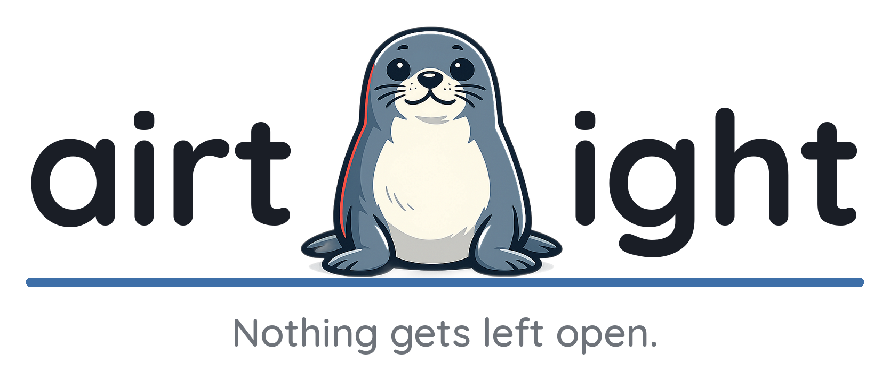
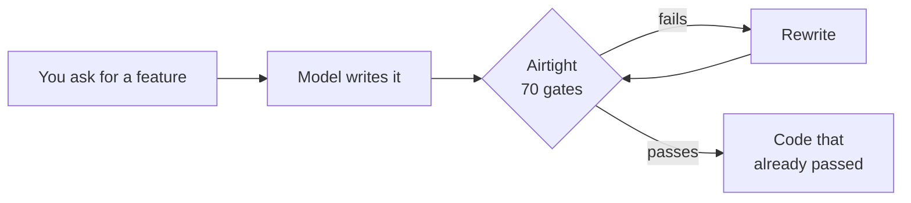

<p align="center">
  <picture>
    <source media="(prefers-color-scheme: dark)" srcset="assets/airtight-logo-dark.png">
    
  </picture>
</p>

<p align="center">
  <a href="LICENSE"></a>
  
  
  
  <a href="https://github.com/Zyoffsec/airtight-secure-coding/stargazers"></a>
  <a href="https://www.linkedin.com/in/ashot-mxitaryan/"></a>
</p>

**AI writes your code. Who checks it?**

Ask for a profile-update endpoint and you get a good one — validated input, parameterized query, ownership checked. The model knows all that. What it skips is the part nobody asked for: the field allowlist. The handler spreads the request body straight into the record, so send `"role": "admin"` next to your new username — and the server writes it. No error, no log, admin.

**Airtight is the part of the request nobody makes:** hard gates on what the assistant may emit, checked *before* the code reaches you.



## Measured, not claimed

One login brief, two agents — one with Airtight, one without. A blind third scored and ran both.

> **26 applicable gates &rarr; 25/26 with Airtight, 16/26 without.**

Both builds got the fundamentals right — password hashing, parameterized SQL, `httpOnly` cookies, session regeneration. The model is not incompetent. The control's ten failures are the part nobody asks for: a timing oracle on login, a hardcoded session-secret fallback, stack traces in error responses, no schema validation, a swallowed exception, no security log, no rate limit, no lockout. **Omissions and defaults, not broken crypto.**

The one gate the Airtight build failed is in the scorecard too — Gate 101, a swallowed `catch` in its own password helper. Measured means measured, including our own miss.

Every verdict was adversarially re-derived by a second auditor told to refute it; none was overturned. The other 41 of the 67 gates that existed at the time never apply to a login app — injection, XSS, SSRF and supply-chain checks had nothing to bite here. Per-gate protocol with file:line evidence &rarr; [`validation/scorecard.md`](validation/scorecard.md).

**Three gates are missing from that number.** Cross-site request forgery and framing — gates 130 to 132 — were added after the audit ran, and both builds predate them. At least two of the three look applicable to a cookie-authenticated login app, which means the control's score would likely fall further and Airtight's might too. Nobody has scored them. Saying so is cheaper than a number we did not measure.

Both apps and the full comparison &rarr; [`validation/`](validation/).

## Install

Type these two lines in Claude Code:

```
/plugin marketplace add Zyoffsec/airtight-secure-coding
/plugin install airtight
```

That is the whole installation. **One command brings both halves** — the gates the
assistant reads, and the guard that enforces them — because the plugin carries them
together. Nothing to clone, no settings file to edit, no second step to forget.

Restart Claude Code and it is live. `/plugin uninstall airtight` removes both.

### Why both halves matter

A skill applies when the assistant decides to load it, and that decision is not reliable.
Across six runs of one backend prompt, the skill loaded twice. The four runs it sat out
produced passwords under SHA-256 and an endpoint that returned every user's orders to
anyone who asked. The two it loaded produced argon2id, a rate limit, an attempt counter
and an ownership check. The gates were never the problem; reaching for them was.

The guard has no such discretion. It runs on the write itself, refuses the failures it can
prove, and asks for the registry by name the first time a session touches a security
surface — so the skill loads because something deterministic asked for it, not because
attention held.

What the guard denies, and what it deliberately leaves alone &rarr;
[`hooks/README.md`](hooks/README.md).

### What it costs

Claude Code reports the plugin's footprint itself — `/plugin details airtight`:

| | |
| --- | --- |
| Every session, always | **~99 tokens** |
| When the skill actually fires | ~4.6k tokens |
| The guard | **no model context cost** — it runs in the harness |

The guard is free to keep because it never enters the conversation: it reads the write,
decides, and either says nothing or refuses. You pay tokens when it refuses, and what you
pay for is the fix.

### Updating

Nothing to do. Claude Code refreshes marketplaces and updates installed plugins on its
own, so a release reaches you without a command. `/plugin update airtight` forces it early
if you want a fix now.

That is the platform updating something you installed through it, on its own schedule and
with its own integrity checks — not this project reaching onto your machine. Airtight
itself never pulls or executes remote code: auto-fetching onto the execution path is Gate
93 and Gate 95, and a tool that exempts itself from its own gates is not one. The
skill-only install has no such channel, so the repository carries an opt-in weekly version
check for it that reports a new release and installs nothing.

### Skill only, no plugin

An alternative to the plugin, not an addition to it. The plugin already carries the skill,
so installing both leaves you with two copies of the same gates loaded under different
names — pick one path.

If you would rather not use the plugin system, this installs the gates alone. You lose the
guard, and with it the enforcement:

```bash
# asks where to install: this project or globally
npx skills add Zyoffsec/airtight-secure-coding

# or install globally for all projects, no prompts
npx skills add Zyoffsec/airtight-secure-coding -g -y
```

To add the guard afterwards, clone the repository and run `./hooks/install.sh` — it
self-tests the guard first, backs your settings up, leaves every other hook alone, does
nothing on a second run, and `--uninstall` reverses it exactly.

### Coming from 0.1.0

Install the plugin, then delete your old `~/.claude/skills/airtight` folder. The layout
moved so the plugin system could carry the guard alongside the gates, the registry gained
cross-site request forgery and framing (gates 130–132, 70 in total), and the guard is new.
**No gate number was renamed or reused**, so every citation in your existing reports still
resolves. Full list of changes in [`CHANGELOG.md`](CHANGELOG.md).

## Usage

| Command | What it does |
| --- | --- |
| *(default)* | You write code; gates apply silently. |
| `airtight audit <target>` | Scores code against the gates. Read-only. |
| `airtight harden <target>` | Finds and fixes gate failures. |
| `airtight prove <target>` | Probes your local code with edge-case input. |

## What it catches

**70 gates across 14 topics**, mapped to **OWASP Top 10 (2021) + CWE**. Each is binary and numbered — every finding cites its gate. Full list &rarr; [`skills/airtight/gates.md`](skills/airtight/references/gates.md).

What it **doesn't**: business-logic bugs, unknown CVEs in your dependencies, architecture review, or memory safety in C/C++/unsafe Rust — the registry is web-shaped, so it checks the request handler and says nothing about the allocation underneath it. Those need a human. Airtight is the *first* check, on the mistakes mechanical enough to check mechanically. It never calls code "secure" — only which gates held.

## Demo

*A short recording is coming — one innocent request with one extra JSON field, an account that quietly becomes admin, then the same request against the Airtight build bouncing off Gate 13. It is the point of the whole project. [Contributions welcome.](CONTRIBUTING.md)*

---

MIT License &middot; [Contributing](CONTRIBUTING.md)
